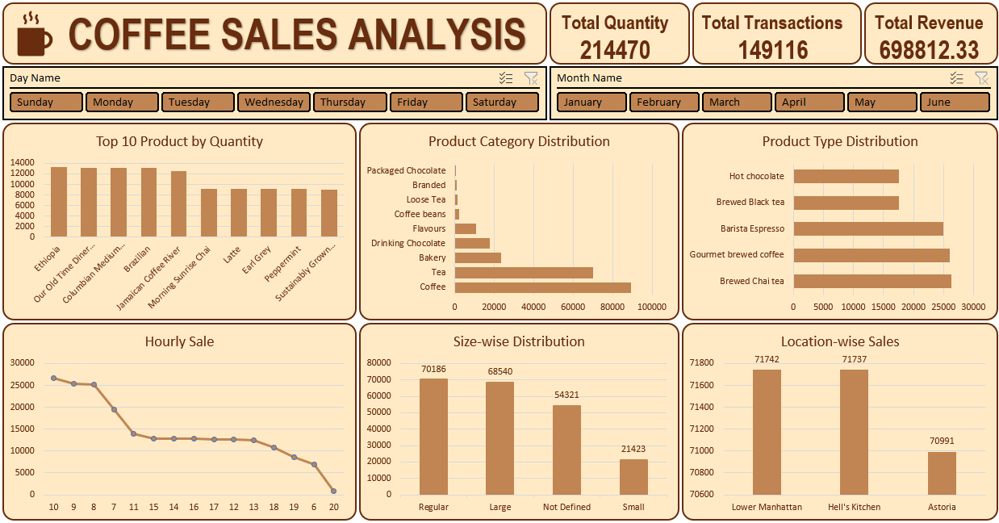

# Coffee Sales Performance and Demand Analysis

## Overview

Analyzed 149,456 coffee shop transactions to evaluate product demand, sales performance, customer purchasing behavior, and location-level trends through an interactive Excel dashboard.

## Dashboard Snapshot

## Key Business Outcomes

* Generated insights from ₹698.8K in revenue across 149,116 transactions and 214,470 units sold.
* Regular and Large sizes contributed 135.7K units, accounting for approximately 63% of total sales volume.
* Lower Manhattan emerged as the highest-performing location with 71.7K units sold, closely followed by Hell's Kitchen (71.1K) and Astoria (71.0K).
* Demand was concentrated among a limited group of products, with the top-selling item exceeding 13K units sold.
* Sales activity peaked during morning hours, indicating stronger demand during early operating periods.

## Analysis Scope

* Product Performance
* Category Demand Analysis
* Store-Level Sales Comparison
* Size-Wise Purchasing Patterns
* Hourly Sales Trends
* Day and Month Performance Tracking

## Methodology

* Cleaned and transformed raw transactional data using Power Query.
* Created analytical dimensions including Revenue, Month, Day, Hour, and Size.
* Built data models using Pivot Tables and Power Pivot.
* Developed an interactive dashboard for multi-dimensional sales analysis.

## Skills Demonstrated

Business Analytics • Sales Analysis • Demand Forecasting Support • KPI Reporting • Data Cleaning • Power Query • Power Pivot • Excel Dashboarding

 

Project by [**Anurag Chauhan**](https://www.linkedin.com/in/theanuragchauhan/)
